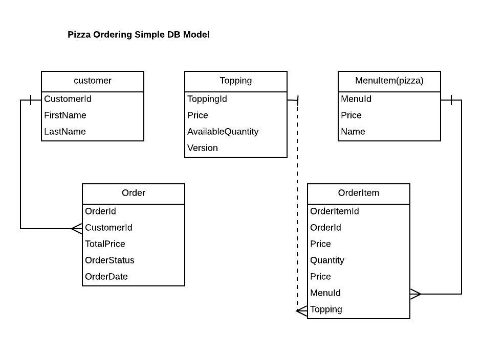

# To run this spring boot application. Please follow the below instructions

## Build the jar using mvn command

1. mvn clean package

 When the build is successful, it displays the below message

 ########################################## 
 ### Build Completed for Naples Pizza. ### 
 ### Please use http://localhost:8080 ### 
 ##########################################

## To run the jar 

2. java -jar target/naplespizza-0.0.1-SNAPSHOT.jar

 ## To Call the API, please use the POSTMAN collection 

1. Import the postman collection from this project (/documents/PizzaAPI.postman_collection.json)

# Documentation

## API design documentation

https://naplespizza.restlet.io/

## Database Model Diagram

